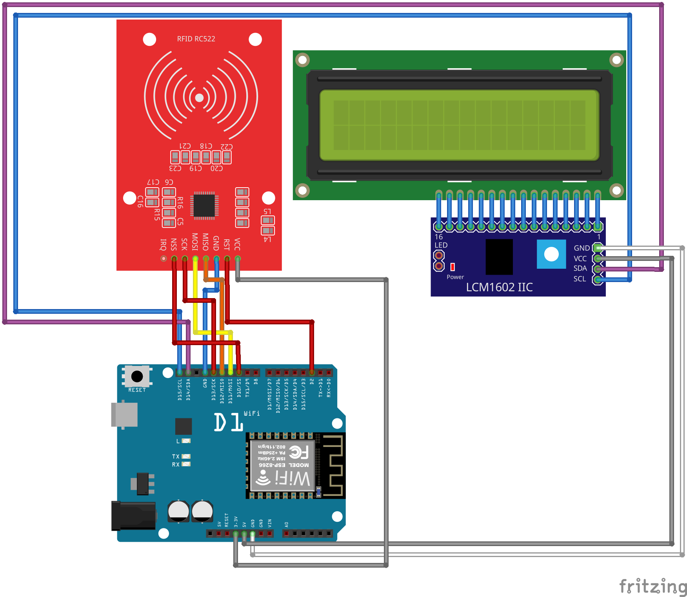
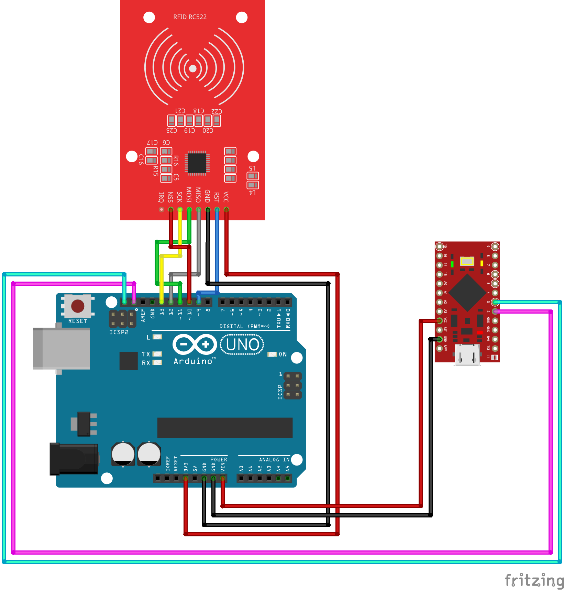

# Esquemes dels dispositius

Aquests esquemes corresponen a la part de lectura dels dispositius del projecte:

[https://github.com/alviboi/projecte_ceedcv](https://github.com/alviboi/projecte_ceedcv)

L'esquema del dispositiu de fitxatxe és:

Esquema del lector de rfid

Tenim els arxiu en fritzing per si a partir dels mateixos volem elaborar una pcb.